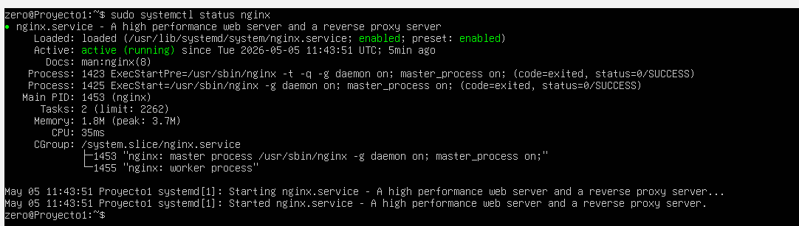
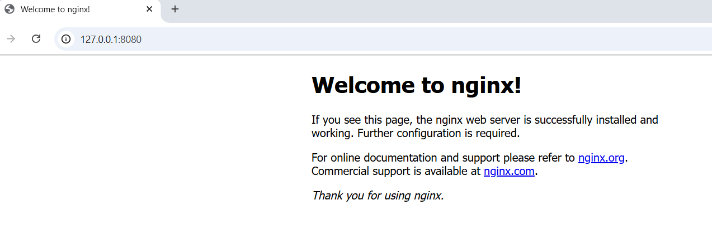
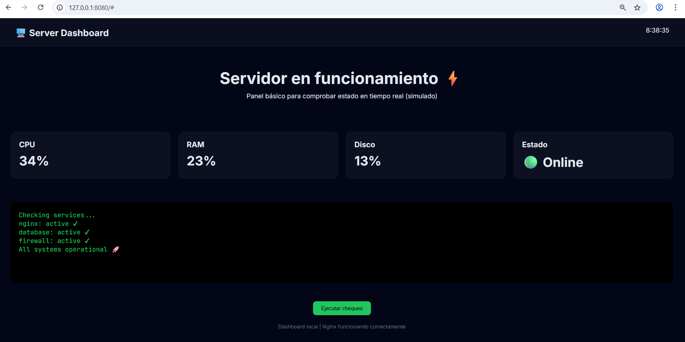

# Servidor Web en Linux (ASIR)

## 📌 Objetivo
Montar un servidor Linux accesible por SSH y servir una página web usando Nginx.

## ⚙️ Tecnologías utilizadas
- Ubuntu Server 24.04 LTS
- Nginx
- SSH
- VirtualBox

## 🔧 Pasos realizados

### 1. Instalación del sistema
Instalación de Ubuntu Server en máquina virtual.

### 2. Configuración de red
Uso de NAT con redirección de puertos para acceso desde el host.

### 3. Configuración de SSH
Instalación y activación del servicio SSH para acceso remoto.

### 4. Instalación de servidor web
Instalación y configuración de Nginx.

## 📸 Evidencias

### Estado del servicio SSH

### Estado del servidor Nginx

### Página web funcionando

## 🧠 Aprendizaje
- Uso básico de Linux
- Gestión de servicios con systemctl
- Configuración de red en máquinas virtuales
- Instalación y uso de servidor web
